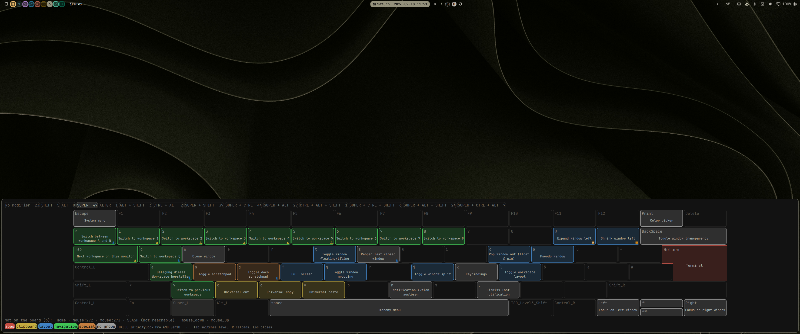

# Shortkeyz

A fullscreen keyboard map for [Omarchy](https://omarchy.org/): every Hyprland
binding drawn on the key it sits on, coloured by group, one tab per modifier
level. Hold a modifier and the map follows; every key you press is framed in
white while it is down.

It answers the question a keybinding list answers badly — not "what does
`SUPER + G` do" but "what is on `SUPER` at all".



*Big Thanks to @spheenik for the idea.*

## Install

```bash
omarchy plugin add https://github.com/schmunk42/omarchy-shortkeyz --enable
```

Open it from a terminal:

```bash
omarchy-shell shell toggle io.github.schmunk42.shortkeyz
omarchy-shell shell toggle io.github.schmunk42.shortkeyz '{"level":"SUPER"}'   # on a level
```

Or bind a key in `~/.config/hypr/bindings.lua`:

```lua
o.bind("SUPER + SHIFT + K", "Keyboard map",
  "omarchy-shell shell toggle io.github.schmunk42.shortkeyz")
```

Inside the overlay: `Tab` cycles levels, `R` reloads, `Esc` closes.

## Configure

Everything is optional — without configuration the shipped defaults are used.

| File | What it does |
|---|---|
| `~/.config/schmunk42-shortkeyz/boards/*.json` | your keyboard: one entry per key with its XKB name and position in key units |
| `~/.config/schmunk42-shortkeyz/groups.toml` | which binding belongs to which group, and each group's colour |

Both fall back to the versions shipped in `defaults/`. A board of your own
wins over a shipped one with the same `id`.

`groups.toml` carries `[meta] colorspace = "screen"` when its colours are
meant as written. Without that key the values are treated as LED colours and
toned down for the screen — that way a `groups.toml` written for keyboard
backlighting can be reused unchanged.

The shipped `groups.toml` and a few key labels assume a **German layout**:
the twelve resize entries sit on `ssharp` and `dead_acute` (the two keys right
of `0`), and umlauts and `ß` are printed as such. On another layout those
entries simply never match — nothing breaks, the keys just show their own
keysym and no group. Copy the file and rename the keys for your layout;
`hyprctl binds` tells you what Hyprland calls them.

Inspect what was loaded and what could not be placed:

```bash
<plugin-dir>/helper/keyboard-map.py --check
<plugin-dir>/helper/keyboard-map.py --list-boards
```

## Your own board

Two boards ship with the plugin: a generic ISO-105 keyboard, which is what you
get on unknown hardware, and the TUXEDO InfinityBook Pro AMD Gen10 the plugin
was written on. While the generic one is on screen, the header line says so and
names the way out.

Generate a draft for your own keyboard:

```bash
<plugin-dir>/helper/keyboard-map.py --list-devices
<plugin-dir>/helper/keyboard-map.py --new-board --device "CHERRY"
```

The draft lands in `~/.config/schmunk42-shortkeyz/boards/<id>.json` — never
inside the plugin, whose directory is watched and would reload on every write.
An existing file is never overwritten; delete it or pass `--id`. With two
keyboards attached, `--device` is required: a plausible board for the wrong
keyboard is worse than none.

What the generator can and cannot do is worth knowing before you start. It
places the keys your device reports through
`/sys/class/input/event*/device/capabilities/key` on a generic ISO-105
geometry, and it writes a `match` block so the board recognises its keyboard
later — the USB ids for an external one, the machine's DMI product name for a
built-in one. It cannot know **where** the keys sit: `xkeyboard-config` has
generic geometries and a handful of vendors, and nothing else does. Expect to
correct widths, the Fn row and the right-hand special keys by hand, and to fill
in `fnSym` (which `XF86` symbol sits on which F-key) yourself — no system
source carries it.

Do not read the key count as an inventory, either. The evdev bitmap is a
*capability* declaration, and both keyboards measured here declare very nearly
the full PC set — the built-in laptop keyboard claims a numpad and a navigation
cluster it does not have. The draft lists what it could not place (`notes` in
the board file), which is the part you want to look at.

`x`, `y`, `w`, `h` are in key units, `w` and `h` default to `1.0`, and `shape`
takes a polygon in the same units for L-shaped keys.

## Colours on an LED keyboard

The groups are not only a legend. `groups.toml` is the same file the keyboard
backlighting on this machine reads, so the colour a binding has in the overlay
is the colour its key can light up in when you hold the modifier: apps red,
navigation green, layout azure, special orange, clipboard yellow.

That sharing is why the lookup has three stages. The plugin reads, in order,
`~/.config/schmunk42-shortkeyz/groups.toml`, then
`~/.config/schmunk42-keyboard-color/groups.toml` — the LED daemon's file — and
only then its own default. Assigning a new shortcut to a group in one place
changes both.

The LED side is not part of this plugin and is not needed to use it; per-key
RGB is a protocol per vendor. What this plugin provides is the classification
and the colours, in a form something else can read.

## Requirements

Everything below is present on a stock Omarchy install:

| Needs | For |
|---|---|
| `python3` ≥ 3.11 | the helper that builds the display model (`tomllib` for `groups.toml`) |
| `hyprland` (`hyprctl`) | the bindings and the focused monitor |
| `libxkbcommon` (`xkbcli`) | the loaded keymap — which symbol sits on which key |
| `coreutils` (`timeout`) | guards the helper call |

The plugin starts no service, opens no socket and reaches no network. It runs
one short-lived Python process per open, reads `~/.config`, `/usr/share/omarchy`
and `/sys/class/input`, and writes nothing — except `--new-board`, which writes
the one board file it is asked for.

One thing it does beyond reading: if `~/.local/bin/schmunk42-keybindings-doc`
exists, the helper **imports it as a Python module** on every open, to fill the
small provenance mark on each key (changed / own / re-registered). That file
is the author's own tooling and won't exist on your machine; if you create a
file by that name, be aware it gets executed as your user. Errors in it are
caught and reported in the overlay's status line, not fatal.

What the helper could not do — no answer from `hyprctl`, an unreadable board
file, a `groups.toml` that doesn't parse — is shown as a `⚠` line in the
overlay and listed by `--check`, never silently turned into an empty board.

## Tests

The parsing and colour maths run without a Wayland session, against a
checked-in keymap dump:

```bash
python3 -B -m unittest discover -s tests -v
```

`-B` matters when the checkout is the installed plugin: a `__pycache__` inside
the plugin directory makes Omarchy reload it. The same command runs in CI on
every push.

## Remove

```bash
omarchy plugin remove io.github.schmunk42.shortkeyz
```

Your own boards and `groups.toml` stay in `~/.config/schmunk42-shortkeyz/`;
delete that directory to remove them too.

## License

MIT — see [LICENSE](LICENSE).
